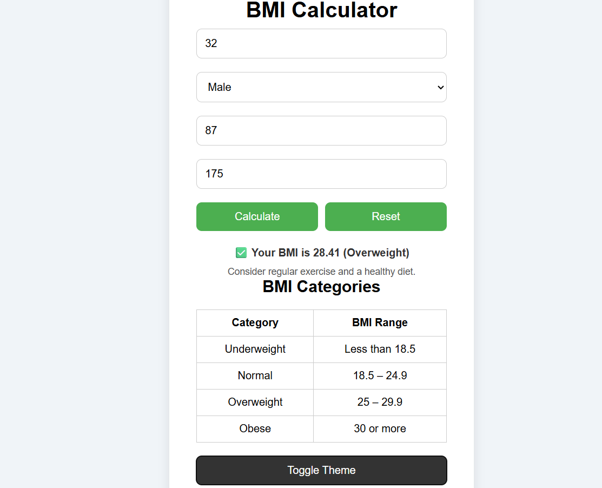
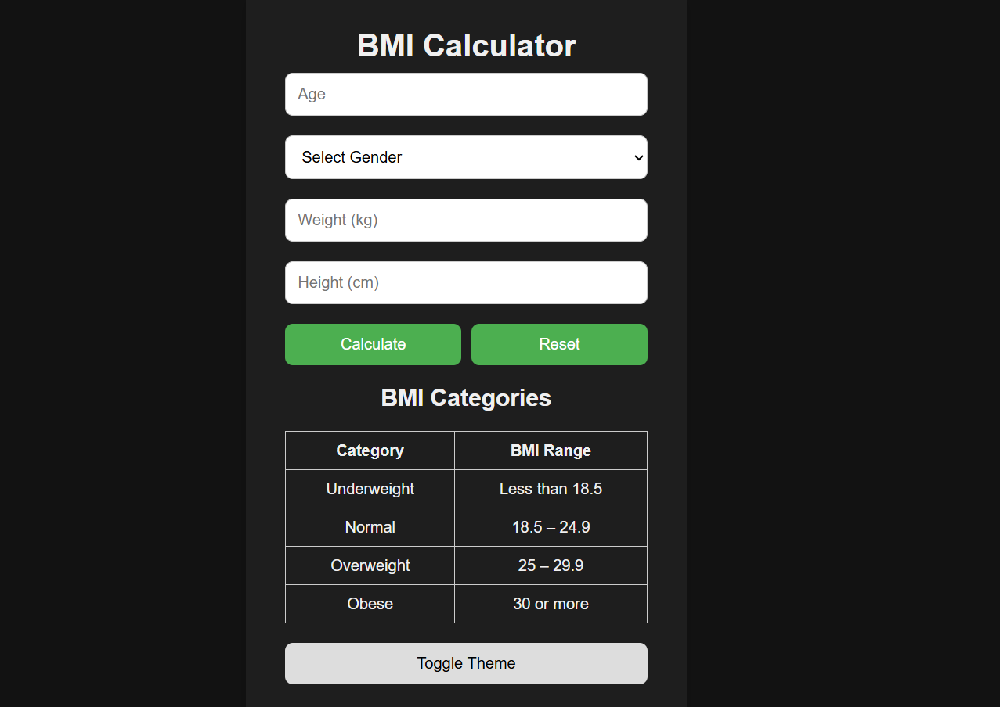
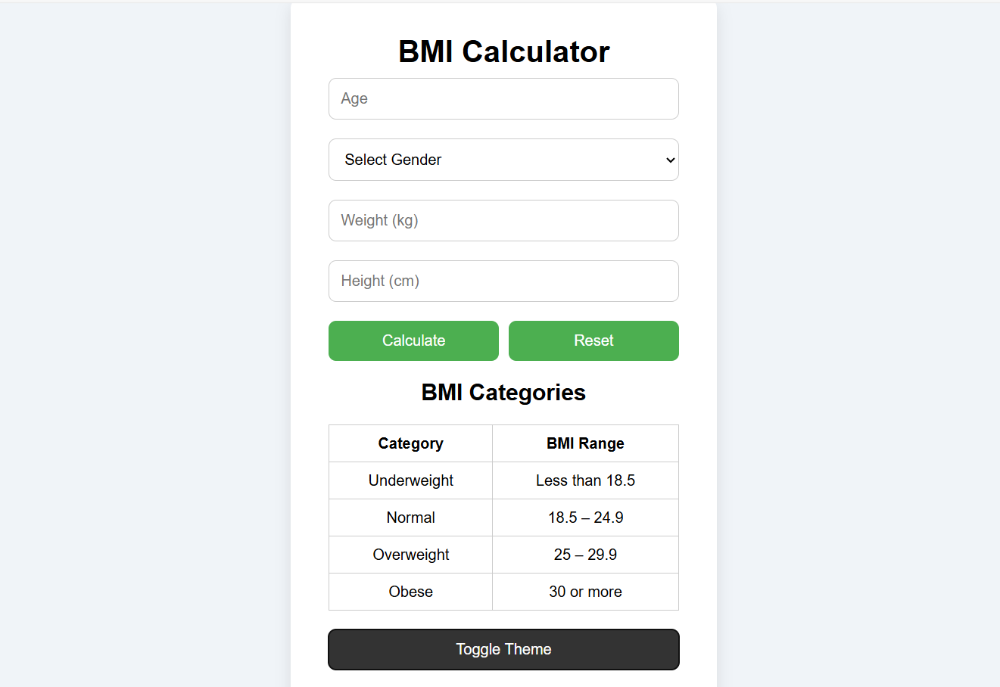

# ⚖️ BMI Calculator

A responsive, interactive Body Mass Index (BMI) calculator built with **HTML, CSS, and JavaScript**.  
Easily calculate your BMI based on height and weight inputs, and get real-time feedback with personalized health status, icons, and animations.

---

## 🌟 Features

✅ Real-time BMI calculation  
✅ Input validation and friendly error messages  
✅ Health category display (Underweight, Normal, Overweight, Obese)  
✅ Dynamic icons and messages based on BMI range  
✅ Responsive UI for all screen sizes  
✅ Light and Dark Mode toggle  
✅ Smooth transitions and animations  
✅ Pure frontend (no backend required)

---

## 🛠 Tech Stack

**Frontend:**  
- HTML5  
- CSS3  
- JavaScript  
- CSS Animations  
- Font Awesome / Emoji for icons

**Tools:**  
- Visual Studio Code  
- GitHub for version control  
- Live Server (VS Code extension)

---

## 📜 Pages

1️⃣ **Main Page** – Input height and weight to get your BMI and health status.  
2️⃣ **Theme Toggle** – Switch between light and dark modes.  
3️⃣ **Responsive Design** – Works perfectly on mobile, tablet, and desktop.  
4️⃣ **Dynamic Output** – Health category with changing visuals.

---

## 👨‍💻 Team Member

| Name        | ID       |
|-------------|----------|
| Ahmed Faiza | C231465  |

---

## 📌 Setup & Installation

### 1️⃣ Clone the Repository
    ```bash
    git clone https://github.com/your-username/bmi-calculator.git
### 2️⃣ Open in VS Code

Navigate to the project folder and open it in Visual Studio Code.

### 3️⃣ Run the App

    Use the Live Server extension
    OR

    Open index.html directly in your browser
## 📅 Development Roadmap

🟢 Phase 1 – Build BMI formula and structure UI

🟡 Phase 2 – Add health status feedback

🔵 Phase 3 – Introduce theme toggling

🟣 Phase 4 – Final UI polish and animation

## 📸 Screenshots


### 🌞 Light Mode


### 🌙 Dark Mode


## 📄 License

This project is licensed under the MIT License – feel free to use and modify it.

## 🎯 Health meets simplicity — Know your body in seconds!
